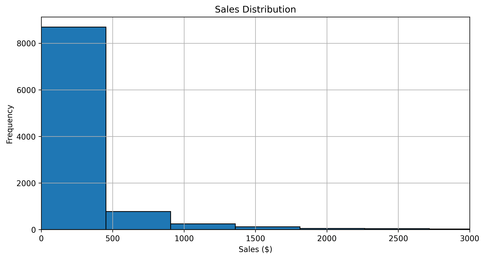
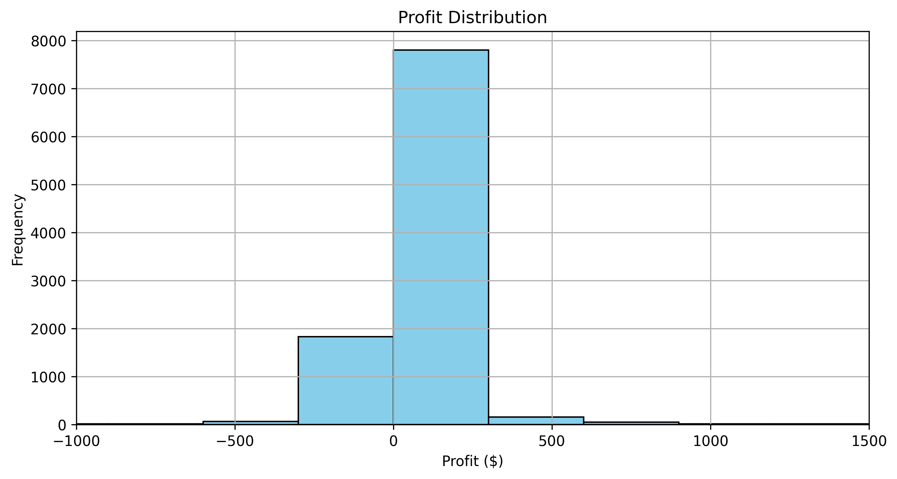
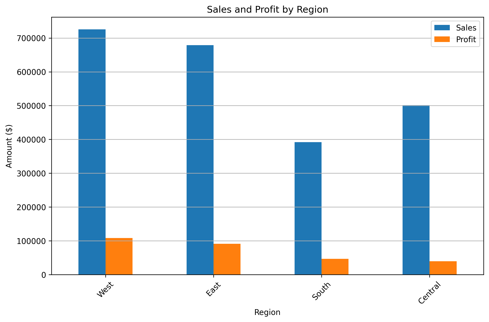
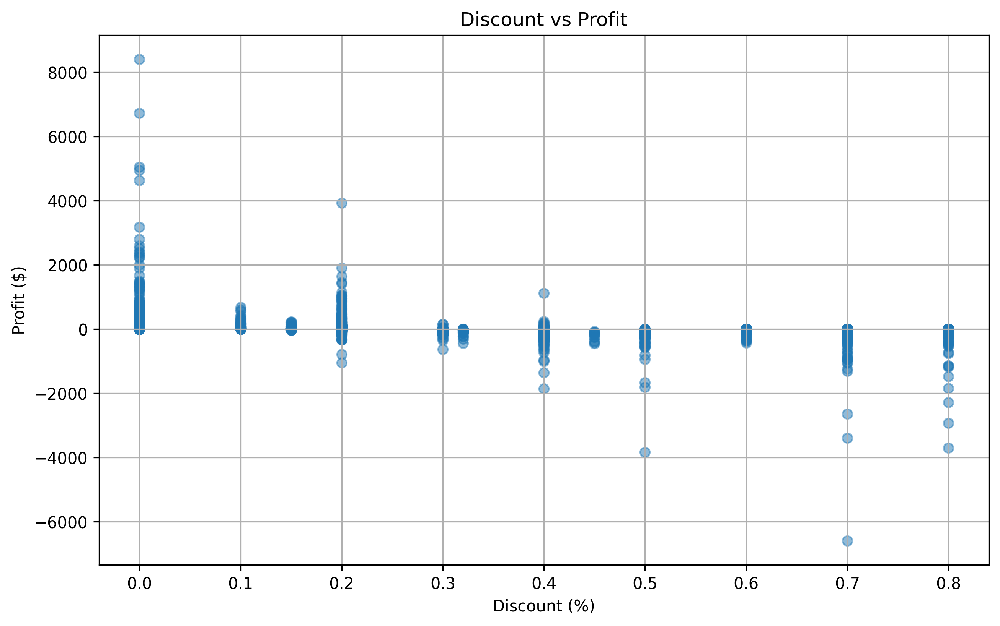

# Sales and Profit Analysis for a Retail Company

## Project Overview

This project analyzes the sales and profitability data of a retail company that sells furniture, office supplies, and technology products.  
The goal is to uncover actionable business insights that improve profit margins, reduce loss-making transactions, and optimize decision-making in pricing, region-level sales strategy, and customer targeting.

The project includes:
- Data cleaning and feature engineering
- Exploratory data analysis (EDA)
- A binary classification model to predict whether an order is profitable
- Strategic recommendations for business improvement

---

##  View the Full Interactive Notebook

**Click here to view the full HTML notebook**: [Open Rendered Notebook (.html)](https://minhha-online.github.io/Sales-Analysis/sales_profit_analysis.html)

---

## Dataset

- **Source:** Sample Superstore Dataset (CSV)
- **Rows:** 9,994 transactions
- **Fields Used:** Sales, Profit, Discount, Category, Segment, Region, Dates, etc.
- **Tools:** Python, pandas, matplotlib, scikit-learn

---

## Data Cleaning

- Converted date columns to datetime
- Removed irrelevant columns (e.g. Row ID)
- Checked for and confirmed no missing values

---

## Feature Engineering

Created the following business-driven features:
- **Profit Margin (%):** Profit relative to sales
- **Shipping Delay (Days):** Time between order and shipping
- **Discount Bucket:** Categorized discount level
- **Profitable Label:** 1 if profit > 0, otherwise 0

---

## Exploratory Data Analysis (EDA)

Key patterns were visualized using histograms, scatter plots, and bar charts:

### Sales Distribution

Most transactions are below $3,000, revealing a volume-driven sales model.

---

### Profit Distribution

Profits vary widely. Some orders generate large losses, especially under heavy discounts.

---

### Sales and Profit by Region

The West performs well; the South contributes to significant losses despite sales.

---

### 🔹 Discount vs Profit

Higher discount rates strongly correlate with reduced profitability.

---

## Predictive Modeling

- **Goal:** Predict if an order will be profitable based on transaction details.
- **Model:** Logistic Regression (binary classifier)
- **Features Used:** Sales, Discount, Shipping Delay, Category, Segment, Region
- **Performance:** ~94.3% accuracy on the test set
- **Interpretation:** The model is effective for pre-screening high- vs. low-margin transactions.

---

## Evaluation Summary

- **High precision and recall** for profitable orders
- **Low false positives** (rarely misclassifies unprofitable as profitable)
- **Business Use:** Can be used in CRM to flag risky deals or rank high-margin opportunities

---

## Business Recommendations

1. **Reevaluate the South Region**  
   Sales are not converting to profit. Audit operations or consider pricing/product adjustments.

2. **Tighten Discounting Strategy**  
   Avoid blanket discounts. Use smarter segmentation and value-based incentives.

3. **Invest in High-Margin Categories**  
   Copiers and Technology perform best. Expand them in profitable regions.

4. **Use Predictive Modeling in Sales Process**  
   Integrate into CRM or lead-ranking tools to prioritize profitable deals.

5. **Optimize for Small Transactions**  
   Since most orders are small, focus on process efficiency and cross-sell bundling.

---

## Future Work

- Customer cohort & RFM analysis
- Profit margin simulation under different discounting policies
- Time series forecasting of revenue by category/region
- Region-category profitability heatmap
- Alert system for identifying potentially loss-making orders before confirmation

